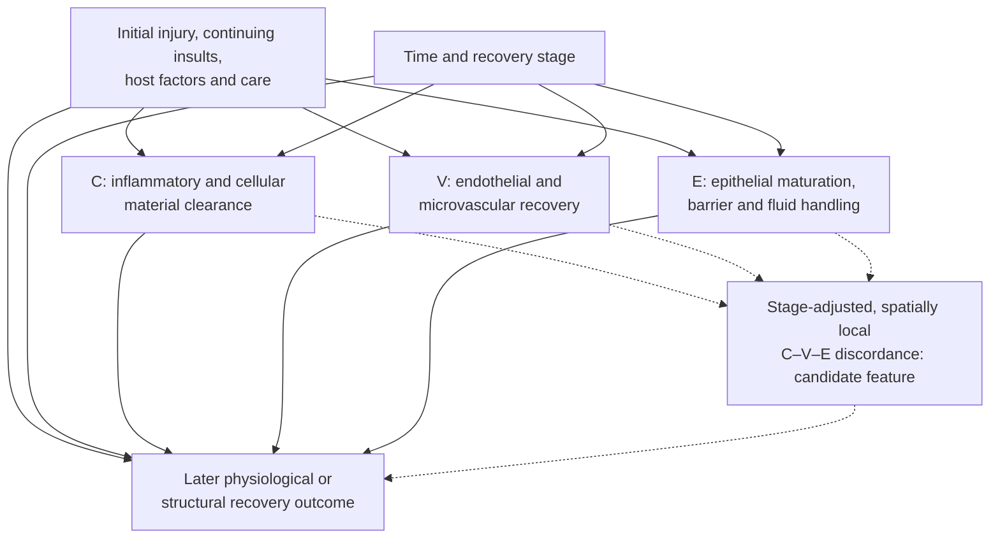

# Resolution Mismatch Across the Alveolar–Capillary Unit After Severe Influenza

### A stage-aware, spatially testable hypothesis of persistent lung dysfunction

> **Article type:** Conceptual Perspective / Hypothesis  
> **Version:** `v0.1.0` · **Date:** 8 October 2026  
> **Status:** Public-draft preprint; **not peer reviewed**; no original experimental or patient-level analysis  
> **Authorship:** Artem Tsyplakov  
> **Persistent identifier:** https://github.com/grimich/Resolution-Mismatch-Across-the-Alveolar-Capillary-Unit-After-Severe-Influenza
> **Subject:** Influenza-associated acute lung injury; alveolar–capillary recovery; causal and predictive modelling

## Abstract

Severe influenza-associated lung injury involves epithelial and endothelial damage, inflammatory-cell recruitment, altered coagulation, edema, and impaired regeneration. Their interactions are well described, and the need for coordinated resolution is not a new observation. Yet a narrower question remains open: does *discordance among local recovery trajectories* explain subsequent dysfunction beyond initial injury severity, the levels of impairment within individual compartments, and the ordinary sequence of tissue repair? We formulate a **cross-compartment resolution-mismatch hypothesis** for the alveolar–capillary unit. It concerns the relative timing and spatial correspondence of three domains: clearance of dying cells and inflammatory material (C), endothelial and microvascular recovery (V), and epithelial maturation with restoration of barrier and fluid-handling function (E). We separate this proposed relationship from established biological mechanisms, describe a stage-adjusted candidate mismatch construct, and specify competing burden-only, stage-only, and relational models. Discriminating predictions address incremental out-of-sample performance, microanatomical alignment, temporal precedence, and contextual dependence of epithelial transitional states. We present falsifiers and a secondary-analysis pathway using existing observational and archived research resources. Evidence from human H5N1 pathology establishes severe alveolar injury, but does **not** directly validate the proposed mismatch mechanism. The article offers a bounded, testable conceptual proposition, not a demonstrated causal mechanism, a clinical tool, or a proposal for further high-risk pathogen manipulation.

**Keywords:** influenza; H5N1; acute respiratory distress syndrome; efferocytosis; immunothrombosis; alveolar epithelium; endothelial recovery; resolution of inflammation; spatial heterogeneity; hypothesis testing

---

## 1. Background: what is already known, and what is not claimed here

Influenza-associated acute respiratory distress syndrome (ARDS) is understood as a coupled injury of the alveolar epithelium, pulmonary endothelium, inflammatory compartment, and fluid-transport system. Short and colleagues provided an integrated account of influenza-induced ARDS [1]. Matthay, Ware, and Zimmerman explicitly described resolution of acute lung injury as requiring effective, **synchronous** removal of edema and inflammatory material and repair of epithelial and endothelial barriers [2]. It would therefore be inaccurate to claim that this article discovers the importance of coordinated recovery.

Subsequent research has further refined this picture. Work on influenza-associated cell fates integrates cell death, innate immune responses, and regeneration [3]. A broad 2026 ARDS review brings together inflammatory, vascular, and reparative processes [4]. Spatial and temporal study of lung repair during experimental H1N1 infection predates this manuscript [15]. A 2026 review emphasizes the interdependence of epithelial, immune, endothelial, stromal, and extracellular-matrix niches during lung regeneration [16]. **Multicellular coordination and spatial organization are prior art, not the novel claim here.**

The narrower proposal is to distinguish three empirically competing explanations of persistent dysfunction: (i) the magnitude of residual injury, (ii) the expected differences in recovery timing among compartments, and (iii) *excess, locally co-occurring discordance relative to that expected recovery sequence*. The hypothesis is scientifically useful only if the third explanation can be measured independently of the outcome, improves prediction or explanation beyond the first two, and survives tests against measurement artifacts and common-cause confounding.

Human H5N1 pathology motivates the question but constrains inference. Nakajima and colleagues described diffuse alveolar damage and inflammatory infiltration in archival lung tissue from five fatal human cases of avian H5N1 influenza [5]. These cross-sectional fatal cases cannot establish longitudinal coupling of clearance, vascular recovery, and epithelial maturation in survivors. Accordingly, the mechanism hypothesized below is **influenza-relevant and ARDS-informed, not H5N1-validated**.

### Explicit contribution boundary

| Already established in the cited literature | Proposed here; not yet demonstrated |
| --- | --- |
| Successful recovery involves multiple interdependent compartments [1–4, 16]. | Whether **stage-adjusted local discordance** explains residual recovery outcomes beyond compartment-specific impairment. |
| NET-associated injury and imperfect inflammatory-material clearance occur in relevant models or ARDS cohorts [6, 7]. | Whether their **relative timing and localization** with vascular and epithelial recovery are independently informative. |
| Transitional epithelial states can precede regeneration or persist in disease [10–12]. | Whether the **same transitional signature** carries different prognostic information according to neighboring compartment trajectories. |
| Spatial and temporal heterogeneity has been observed during experimental influenza recovery [15]. | Whether spatially matched, temporally ordered **cross-domain features** outperform suitably controlled non-relational explanations. |

This manuscript introduces no new pathway, molecule, phenotype, therapeutic target, or biological observation.

## 2. Mechanistic substrate: three distinguishable recovery domains

The unit of analysis is a **local alveolar–capillary region**, not a whole-lung average. The three domain labels are analytic constructs; each comprises several non-identical biological processes. They must not be replaced by single unvalidated biomarkers.

### 2.1. Clearance and inflammatory resolution (C)

Neutrophil extracellular traps (NETs) can accompany pulmonary injury in experimental influenza models [6]. In human ARDS, Grégoire and colleagues reported impaired macrophage efferocytosis and NET clearance, supporting a distinction between production of inflammatory material and its removal [7]. Influenza-injured alveolar epithelial cells may also be cleared by macrophage populations situated outside the alveolar airspace: a mouse influenza study identified an important contribution of interstitial macrophages to uptake of injured alveolar epithelium [8].

These findings justify considering *clearance competence* separately from inflammatory burden. They do not establish a universal macrophage subtype hierarchy across diseases, species, time points, or regions. Nor does detectable debris identify whether its production increased or its removal declined.

### 2.2. Endothelial and microvascular recovery (V)

Vascular-barrier integrity, microvascular function, and the inflammatory–coagulation interface are distinct from epithelial regeneration. Experimental influenza work has identified protective functions of endothelial aryl hydrocarbon receptor (AHR) activity for lung-barrier integrity [9]. The broader influenza-ARDS and ARDS literatures connect endothelial dysfunction to edema, inflammatory signaling, and altered tissue perfusion [1, 4].

Restoration of one endothelial marker does not imply complete normalization of vascular barrier function, perfusion, or thrombosis-related injury. In particular, activation markers, platelet adhesion, and obstructive microthrombosis are not interchangeable endpoints.

### 2.3. Epithelial maturation and physiological recovery (E)

Alveolar type II (AT2) cells can contribute to regeneration of the alveolar epithelial lining. Damage-associated transient progenitor states have been described during regeneration [10]. KRT8-positive and related transitional epithelial states have also been observed in repair models and in fibrotic human tissue [11, 12]. Their presence does not automatically indicate either successful maturation or pathological arrest; context and later fate matter.

Epithelial structure and physiological function must also be distinguished. Alveolar fluid clearance varies markedly in clinical acute lung injury/ARDS and depends on epithelial transport processes [13, 14]. The presence of a transitional epithelial signature is therefore not a substitute for evidence of mature barrier or fluid-handling function.

### 2.4. Cross-compartment inference is the unresolved part

The literature supports the *existence and importance* of C, V, and E. It does not, through these separate findings alone, establish the claimed extra effect of their temporal and spatial mismatch. One can observe ongoing clearance with delayed epithelial maturation, or apparent epithelial restoration alongside persistent vascular dysfunction, without having shown that discordance itself worsens outcome. Such states constitute hypotheses to compare, not proven steps of a fixed pathological sequence.

## 3. Central hypothesis and its alternatives

> **Cross-compartment resolution-mismatch hypothesis (H₂):** Conditional on initial injury severity, continuing insults, disease stage, host factors, treatments, and the individual recovery states of C, V, and E, **locally co-occurring deviations from expected inter-compartment recovery relationships** predict worse subsequent functional recovery.

The hypothesis concerns a *relational property* of a damaged region. It does not require every compartment to recover simultaneously or at the same rate. Physiological precedence, delay, and overlap may be normal. The relevant departure is from a justified, context-dependent temporal relationship, not from numerical equality among biomarkers.

Three explanations must be compared:

| Model | Primary explanation | Distinguishing prediction |
| --- | --- | --- |
| **H₀: Injury burden** | Severity and ongoing injury determine later outcomes; C, V, E contribute via their own levels. | Adding stage-adjusted discordance provides no stable incremental information after strong severity and main-effect controls. |
| **H₁: Recovery stage** | Apparent mismatch is simply expected sequential recovery or differences in disease phase. | A sufficiently flexible stage-aware model explains apparent misalignment without relational terms. |
| **H₂: Relational mismatch** | Beyond burden and ordinary staging, locally discordant C–V–E recovery trajectories contribute additional information. | A predeclared relational model improves external predictive performance and survives matched spatial and temporal negative controls. |

H₂ is **not** a default interpretation of slow recovery. Failure of H₂ remains compatible with the broader, already established idea that multiple compartments matter.

## 4. Conceptual figure: domains, outcomes, and rival explanations

**Figure 1. A hypothesis-testing scheme, not an established causal directed acyclic graph.** Solid arrows summarize known or plausible contextual relationships at a high level; their strengths and precise directions are not identified here. Dashed arrows show construction of a candidate relational feature and the association to be tested. Since the discordance feature is derived from C, V, and E, it is **not an independently intervenable biological entity**. An observed association between this feature and an outcome cannot by itself establish a causal effect of “mismatch.”

## 5. Operational definition for observational testing—not a validated biomarker

Let the putative domain states in region \(r\), time \(t\), and domain \(i\in\{C,V,E\}\) be \(u_i(r,t)\). These are latent recovery constructs to be estimated from justified, separately validated measurements. For discussion only, suppose their scales are anchored so that larger values mean better recovery. Neither a common numeric unit nor comparability across domains can be assumed without validation.

Define an anticipated reference difference between domains \(i\) and \(j\) for a given recovery stage \(s\) and preselected context \(z\):

$$
\Delta^0_{ij}(s,z)
= \mu_i(s,z)-\mu_j(s,z),
$$

where \(\mu_i\) represents an expected domain-specific trajectory estimated in an independent reference set, without using the subsequent outcome being predicted. The reference need not assert a universal ideal clock; it may be stratified, uncertain, and disease-context specific.

A provisional **stage-adjusted relational contrast** is

$$
d_{ij}(r,t)=
\big[u_i(r,t)-u_j(r,t)\big]
-\Delta^0_{ij}(s(r,t),z(r,t)).
$$

A descriptive mismatch summary could be

$$
M(r,t)=\sum_{i<j}w_{ij}
\frac{|d_{ij}(r,t)|}{\sigma_{ij}(s,z)},
\qquad w_{ij}\geq0,
$$

where \(\sigma_{ij}>0\) characterizes reference uncertainty or dispersion, and weights are fixed independently of the outcome. **No values, cutoffs, or weights have been validated.** The equation is a scaffold for evaluating whether a relational feature is measurable and informative.

This formulation avoids two defects of the naive raw pairwise-distance score:

1. **Ordinary biological asynchrony:** the expected difference \(\Delta^0_{ij}(s,z)\) may be nonzero, so legitimate sequential recovery is not automatically called pathological.
2. **All compartments remain impaired:** a low mismatch score can coexist with severe joint dysfunction; therefore \(M\) must never replace the component vector \(\mathbf u\), initial severity, or a separately specified impairment measure.

A stage-adjusted model also cannot be treated as identified if reference trajectories or markers are unavailable, poorly aligned, or dependent on the outcomes. Heterogeneous recovery paths may make a single reference inappropriate. If so, the appropriate result is *no validated mismatch metric*, not a forced score.

### Predictive estimand

Let \(Y_{r,t+h}\) denote a later, independently measured recovery outcome, with higher values representing worse dysfunction, and \(Z\) include defensible baseline and time-varying adjustment variables. The narrow test is whether

$$
\operatorname{Perf}_{\mathrm{external}}
\left[f_2(\mathbf u,s,Z,M)\right]
>
\operatorname{Perf}_{\mathrm{external}}
\left[f_1(\mathbf u,s,Z)\right]
$$

for an appropriate, **preselected** measure of external predictive performance and a fair comparison of model complexity. Model \(f_1\) must permit realistic nonlinear main effects and phase dependence; otherwise \(M\) might merely compensate for an artificially weak baseline.

Because \(M\) is a deterministic summary of \(\mathbf u\), sufficiently flexible \(f_1\) may already capture the same relation. Failure to add predictive value in that setting is substantive evidence **against the need for a new mismatch descriptor**, not a statistical anomaly. Even success demonstrates incremental prediction rather than causal identification.

## 6. Four discriminating predictions and negative controls

**P1 — Beyond burden.** Among comparable baseline-injury strata, a relational term should retain out-of-sample predictive value after accounting for the full component vector and ongoing insults. If it does not, the burden-only account is sufficient for that setting.

**P2 — Beyond normal stage.** After allowing biologically justified stage-specific ordering or lag of the compartments, excess discordance should retain predictive value. If it disappears under an adequately specified stage model, the stage-only explanation is favored.

**P3 — Local alignment matters.** Measurements drawn from genuinely corresponding alveolar–capillary neighborhoods should be more informative than measurements paired across unrelated regions, after preserving case-level severity and measurement distributions. A **spatial-permutation negative control** would compare matched observations against within-case phase-matched shuffled pairings. Failure to distinguish true from shuffled alignment weakens the spatial component of H₂; it does not rule out systemic cross-compartment interactions.

**P4 — Transitional-state context matters.** A transitional epithelial signature should not have an invariant interpretation across varying clearance and microvascular states, after appropriate phase controls. If its association with later maturation or function does not depend on those other domains, the proposed contextual interaction is weakened.

None of these predictions is demonstrated in the present manuscript. Temporal ordering is especially important: synchronous marker correlations alone cannot support a claim that earlier discordance preceded later dysfunction.

## 7. Evidence-to-claim audit

The table below separates study *setting*, evidence actually supplied, and the unproven inferential step. It is a targeted evidence map, **not** a systematic review or meta-analysis.

| Claim used in this manuscript | Evidence and setting | Supported inference | Not established by that evidence |
| --- | --- | --- | --- |
| Severe human H5N1 can involve diffuse alveolar damage. | Histopathology of five fatal human H5N1 cases [5]. | Severe alveolar injury and inflammatory infiltration occurred in the sampled cases. | Temporal coordination of recovery in surviving H5N1 patients. |
| Influenza ARDS comprises interacting epithelial, endothelial, fluid, and inflammatory components. | Integrated influenza-ARDS review [1]. | A multicompartment disease framework is well grounded. | The distinctive predictive value of a new mismatch feature. |
| Coordinated resolution is an established idea. | General ARDS review explicitly discussing synchronous edema removal, barrier repair, and inflammatory clearance [2]; contemporary reviews [4, 16]. | The high-level coordination concept is prior art. | Stage-adjusted, local relational model H₂ in severe influenza. |
| NET-associated injury is possible during influenza pneumonia. | Experimental influenza model [6]. | NETs may participate in lung injury in that model. | Equal contribution across all influenza subtypes or human H5N1. |
| Removal of apoptotic cells and NET material can be impaired. | Human ARDS macrophage study, mixed ARDS etiologies [7]. | Defective clearance is biologically plausible and observed in ARDS. | A universal clearance defect specific to influenza or H5N1. |
| Interstitial macrophages can contribute to epithelial efferocytosis after influenza injury. | Experimental influenza model [8]. | Efferocytosis is not necessarily confined to airspace macrophages. | Human H5N1 compartment-specific efferocytosis kinetics. |
| Vascular responses can protect the lung during viral infection. | Influenza/viral infection experimental study [9]. | Endothelial state may influence lung injury independently of epithelial-cell readouts. | The causal direction or magnitude of a C–V–E mismatch effect. |
| Transitional epithelial states exist and may persist. | Injury/regeneration and fibrosis models or human fibrotic tissue [10–12]. | Transitional state ≠ completed physiological repair. | Their role in all H5N1 survivors; fixed universal recovery sequence. |
| Fluid-handling competence differs across patients with lung injury. | Clinical ARDS evidence [13] and physiological synthesis [14]. | Epithelial transport deserves assessment separately from histology. | A direct relationship between fluid-clearance variation and H₂. |
| Spatial/temporal heterogeneity exists in influenza recovery. | H1N1 mouse recovery study [15]. | Temporal and spatial resolution matters for interpreting repair. | A demonstrated interaction among all three proposed domains. |
| Multicellular niches have been reviewed before. | 2026 lung regeneration mini-review [16]. | Niche coordination is not a new concept in this manuscript. | The proposed three-way incremental model comparison. |

**Evidence status:** The existence of the component mechanisms is supported in the settings shown. Their particular coupling as H₂ remains a **hypothesis**, not an observation or a verified causal conclusion.

## 8. Research design to discriminate H₀, H₁, and H₂

The near-term path is critical appraisal and secondary analysis of already available longitudinal clinical observations, spatial tissue atlases, or archived observational research data. These resources should be selected for **independent evidence of all three domains and a subsequent functional outcome**, not because they produce a desired mismatch score. The proposal does not require new experiments with high-risk influenza agents.

### Minimum eligibility for a dataset

- Adequately defined sampling units, time points, and a disease/recovery phase description independent of future outcome labels.
- Defensible domain-specific measurements of C, V, and E, with explicit recognition of biomarker validity limits.
- A later physiological or structural endpoint that is not itself an ingredient of the predictor.
- Information sufficient to address initial injury severity, continuing infection or other insults, treatment, major host differences, and censoring as far as possible.
- For the *spatial* claim, justified microanatomical registration; otherwise the analysis can test only a weaker temporal or systemic hypothesis.

**No currently cited dataset is asserted to meet all these requirements.** Availability, access rights, and measurement comparability must be audited before analysis. Without such data, quantitative confirmation is impossible.

### Analysis and validation safeguards

1. **Define the reference phase in advance.** Stage variables must not be constructed using the subsequent outcome, because doing so would make the mismatch model circular. Compare calendar time, clinically justified phases, and sensitivity analyses rather than assuming interchangeable disease clocks.
2. **Keep models comparable.** Use held-out patients or independent cohorts—not randomly held-out spatial patches from the same patient alone—to assess generalization. Compare flexible main-effect and phase models against relational models with complexity control.
3. **Predefine a clinically meaningful improvement criterion.** The threshold and predictive metric should be set before examining test outcomes. A nominal improvement in in-sample fit is not sufficient.
4. **Use negative controls.** Spatial shuffling with within-patient phase matching, noncausal marker pairings, and measurement-artifact sensitivity analyses help discriminate biological localization from shared measurement structure.
5. **Model missingness and competing outcomes.** Death, selective tissue sampling, irregular visit schedules, treatment-dependent measurement, and loss to follow-up can invalidate naive survivor-only estimates.
6. **Respect etiology boundaries.** Analyze influenza and non-influenza ARDS separately before transportability claims. Distinguish mouse studies, human fatal H5N1 specimens, and human survivors throughout.
7. **Assess uncertainty, not only point estimates.** Report calibration, interval estimates, subgroup instability, and sensitivity to reference trajectories and marker definitions.

Because recovery, clinical care, ongoing injury, and sample availability influence one another, adjustment for variables measured after injury can introduce additional bias. No causal effect is identified simply by regressing outcome on a computed mismatch index. Stronger causal claims would require a separately specified time-varying causal model and evidence about its assumptions; this article does not assert such identification.

### Falsification criteria

The distinctiveness of H₂ is weakened or rejected in a specified setting if any of the following is robustly observed under adequate data quality:

- A flexible H₀/H₁ model explains later outcomes as well as H₂ within uncertainty bounds that exclude a predeclared practically meaningful gain.
- The putative spatial benefit persists equally when local pairings are shuffled within appropriate strata.
- The effect depends on outcome-derived stage labels, a single arbitrary marker scale, or changes sign under reasonable phase definitions.
- Apparent mismatch is explained by measured continuing injury, treatment effects, specimen selection, or shared measurement error.
- Independent cohorts fail to reproduce the relational signal despite adequate domain measurement and statistical precision.

Absence of a measured effect in a dataset without all three domains or credible spatial alignment is **inconclusive**, not a valid falsification. Conversely, a successful prediction is **support**, not proof of causality or mechanistic uniqueness.

## 9. Implications and limits

The model might help pose more discriminating research questions about heterogeneous recovery, but it is not yet a clinical decision rule. It provides no validated patient-level threshold, no basis for choosing therapies, and no estimate of treatment benefit. Misalignment could reflect *consequence* rather than *cause* of tissue injury; it could also be a useful summary with no independent intervention target. A relational variable derived from compartment states cannot be assumed to exert a separate biological action.

The most important limitation for the motivating H5N1 case is the evidence boundary. Human fatal H5N1 histology [5], experimental influenza mechanisms [6, 8, 9, 15], broader human ARDS observations [7, 13], and regeneration/fibrosis findings [10–12] come from different populations and biological settings. Their conjunction is **a rationale for inquiry**, not direct evidence that all described transitions occur together during H5N1 recovery.

An additional limitation is the absence of a proven reference recovery sequence or valid cross-domain recovery scales. If such reference constructs cannot be established, the proposed mathematical mismatch index should not be reported as if it were a measured biological property. The strongest possible early result may be a clear demonstration that the existing literature cannot identify the target quantity.

## 10. Conclusion

The interactions among inflammation, vascular injury, epithelial damage, and repair in severe influenza are established territory. The contribution attempted here is narrower: **make the relational claim falsifiable** by explicitly distinguishing initial injury burden, expected recovery staging, and excess stage-adjusted spatial mismatch. This comparison can succeed, fail, or remain unidentified depending on the quality of the data. A convincing negative result would argue against introducing “resolution mismatch” as a distinct explanatory quantity; a reproducible positive result would justify deeper investigation, but not automatically a causal or therapeutic claim. The framework therefore offers a testable refinement of existing lung-repair biology, rather than a claim of a newly discovered mechanism.

---

## References

References were checked against publisher or PubMed records available by **8 October 2026**. The list is selective, not exhaustive; article inclusion does not imply experimental confirmation of H₂. Titles and DOIs are provided as external links rather than reproducing third-party figures or text.

1. Short KR, Veldhuis Kroeze EJB, Fouchier RAM, Kuiken T. Pathogenesis of influenza-induced acute respiratory distress syndrome. *Lancet Infect Dis.* 2014;14(1):57–69. [doi:10.1016/S1473-3099(13)70286-X](https://doi.org/10.1016/S1473-3099%2813%2970286-X).
2. Matthay MA, Ware LB, Zimmerman GA. The acute respiratory distress syndrome. *J Clin Invest.* 2012;122(8):2731–2740. [doi:10.1172/JCI60331](https://doi.org/10.1172/JCI60331).
3. Jarboe B, Shubina M, Langlois RA, Boyd DF, Balachandran S. Lung cell fates during influenza. *Cell Res.* 2025;35:707–718. [doi:10.1038/s41422-025-01163-y](https://doi.org/10.1038/s41422-025-01163-y).
4. Tan D, Zhou J, Li L, Zhong Y, Cheng Z, Yang T. The acute respiratory distress syndrome (ARDS): epidemiology, etiology, molecular mechanisms, diagnosis and therapeutic strategies. *Mol Biomed.* 2026;7:130. [doi:10.1186/s43556-026-00532-2](https://doi.org/10.1186/s43556-026-00532-2).
5. Nakajima N, Van Tin N, Sato Y, et al. Pathological study of archival lung tissues from five fatal cases of avian H5N1 influenza in Vietnam. *Mod Pathol.* 2013;26:357–369. [doi:10.1038/modpathol.2012.193](https://doi.org/10.1038/modpathol.2012.193).
6. Narasaraju T, Yang E, Samy RP, et al. Excessive neutrophils and neutrophil extracellular traps contribute to acute lung injury of influenza pneumonitis. *Am J Pathol.* 2011;179(1):199–210. [doi:10.1016/j.ajpath.2011.03.013](https://doi.org/10.1016/j.ajpath.2011.03.013).
7. Grégoire M, Uhel F, Lesouhaitier M, et al. Impaired efferocytosis and neutrophil extracellular trap clearance by macrophages in ARDS. *Eur Respir J.* 2018;52(2):1702590. [doi:10.1183/13993003.02590-2017](https://doi.org/10.1183/13993003.02590-2017).
8. Zuttion MSSR, Parimon T, Yao C, et al. Interstitial macrophages mediate efferocytosis of alveolar epithelium during influenza infection. *Am J Respir Cell Mol Biol.* 2024;70(3):159–164. [doi:10.1165/rcmb.2023-0217MA](https://doi.org/10.1165/rcmb.2023-0217MA).
9. Major J, Crotta S, Finsterbusch K, et al. Endothelial AHR activity prevents lung barrier disruption in viral infection. *Nature.* 2023;621:813–820. [doi:10.1038/s41586-023-06287-y](https://doi.org/10.1038/s41586-023-06287-y).
10. Choi J, Park JE, Tsagkogeorga G, et al. Inflammatory signals induce AT2 cell-derived damage-associated transient progenitors that mediate alveolar regeneration. *Cell Stem Cell.* 2020;27(3):366–382.e7. [doi:10.1016/j.stem.2020.06.020](https://doi.org/10.1016/j.stem.2020.06.020).
11. Strunz M, Simon LM, Ansari M, et al. Alveolar regeneration through a Krt8+ transitional stem cell state that persists in human lung fibrosis. *Nat Commun.* 2020;11:3559. [doi:10.1038/s41467-020-17358-3](https://doi.org/10.1038/s41467-020-17358-3).
12. Kobayashi Y, Tata A, Konkimalla A, et al. Persistence of a regeneration-associated, transitional alveolar epithelial cell state in pulmonary fibrosis. *Nat Cell Biol.* 2020;22:934–946. [doi:10.1038/s41556-020-0542-8](https://doi.org/10.1038/s41556-020-0542-8).
13. Ware LB, Matthay MA. Alveolar fluid clearance is impaired in the majority of patients with acute lung injury and the acute respiratory distress syndrome. *Am J Respir Crit Care Med.* 2001;163(6):1376–1383. [doi:10.1164/ajrccm.163.6.2004035](https://doi.org/10.1164/ajrccm.163.6.2004035).
14. Matthay MA, Folkesson HG, Clerici C. Lung epithelial fluid transport and the resolution of pulmonary edema. *Physiol Rev.* 2002;82(3):569–600. [doi:10.1152/physrev.00003.2002](https://doi.org/10.1152/physrev.00003.2002).
15. Ong JWJ, Tan KS, Ler SG, et al. Insights into early recovery from influenza pneumonia by spatial and temporal quantification of putative lung regenerating cells and by lung proteomics. *Cells.* 2019;8(9):975. [doi:10.3390/cells8090975](https://doi.org/10.3390/cells8090975).
16. Koc-Gunel S, Ryan AL, Hynds RE, Kathiriya JJ. Beyond the epithelium: multicellular niches in lung regeneration and disease. *Am J Physiol Lung Cell Mol Physiol.* 2026;330(6):L770–L779. [doi:10.1152/ajplung.00419.2025](https://doi.org/10.1152/ajplung.00419.2025).

---

## Transparency, attribution and repository release notes

- **Novelty status:** This is a proposed comparative hypothesis, not an original biological discovery. Coordination of lung repair is explicitly credited to prior work, especially [1], [2], [15], and [16]. A targeted literature review does **not** establish priority or exclude all potentially overlapping publications.
- **Data and code availability:** No data were collected or analyzed and no computational study was run. Equations and Figure 1 are conceptual; no repository, dataset, benchmark, or trained model is asserted to exist.
- **Ethics:** No participants, animals, biological specimens, or pathogens were used to generate this manuscript. Any future work would require its own approvals as applicable.
- **AI assistance:** Generative AI assisted drafting, synthesis, editorial revision, and bibliographic checking. The publisher or submitting author(s) must independently verify scientific claims and take responsibility for the final version. AI assistance is not evidence of independent expert peer review.
- **Funding and competing interests:** Unknown from the information provided; no declaration of absence is made. The publisher must add accurate disclosures before representing the manuscript as author-certified.
- **Authorship:** No individual or institution is named or implied as an author. The GitHub uploader is not automatically the scientific author of the work; attribution and accountability require a deliberate decision.
- **Reuse permissions:** The manuscript contains an original conceptual Mermaid diagram and links to, but does not reproduce, figures from cited works. No content license is granted in this draft. If open reuse is intended, the rights holder may select an appropriate license (for example CC BY 4.0) and state it explicitly in a later authorized version.
- **Citation while unassigned:** *Resolution Mismatch Across the Alveolar–Capillary Unit After Severe Influenza: A Stage-Aware, Spatially Testable Hypothesis of Persistent Lung Dysfunction*. Conceptual Perspective, version `v0.1.0` (8 October 2026), unreviewed Markdown manuscript. Add actual author names, release URL, and DOI **only after they exist**.
- **Version semantics:** This file is a **candidate for public release**, not evidence that it was published, peer reviewed, registered, uploaded, or accepted by a journal. Future claims of empirical validation require separate evidence and an explicit versioned revision.
